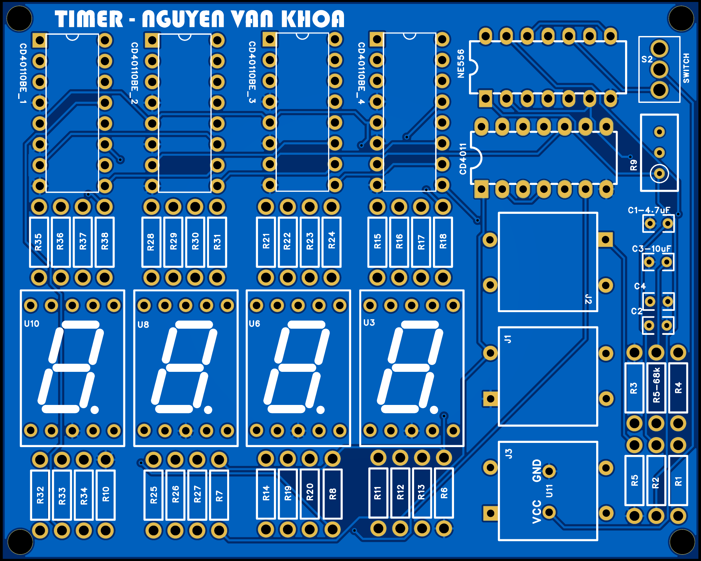
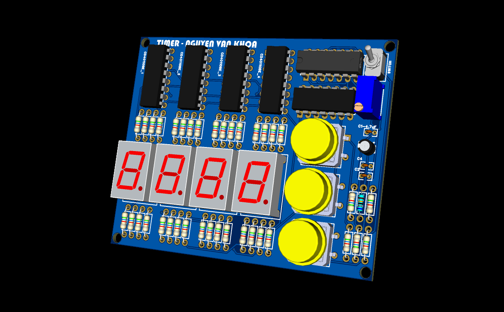

# Pure CMOS Logic Hardware Digital Timer ⏱️

A microcontroller-free, hardware-level digital countdown and count-up timer designed entirely using **CMOS logic ICs** (CD40110BE, CD4011) and precision analog timing networks (**NE556**).

This project demonstrates deterministic state machines, RC switch debouncing, and cascaded decade counting without relying on software, firmware, or programmable logic.

---

## 📸 Hardware Implementation & Simulation

### 1. PCB Layout & 3D Visualization
| 2D PCB Layout | 3D Rendered Board |
| :---: | :---: |
|  |  |

---

## 🚀 Key Functional Architecture

```text
               +--------------------------------------------------------+
               |                  NE556 DUAL TIMER                      |
               |                                                        |
               |   Timer A (1Hz Astable)    Timer B (~20Hz Astable)     |
               |   [68kΩ + 4.7µF]           [100kΩ Pot + 1kΩ + 10µF]    |
               +-------------+---------------------------+--------------+
                             |                           |
                             | 1Hz Clock                 | Setup Clock
                             v                           v
                      +-----------------------------------------+
[SET Button]   -----> |                                         |
[START Button] -----> |      CONTROL & DEBOUNCE LOGIC (CD4011)  |
[RESET Button] -----> |    RC Filters + SR Latch Multiplexing   |
                      +-------------+-------------------+-------+
                                    |                   |
                        Clock Down  |                   | Clock Up
                                    v                   v
                      +-----------------------------------------+
                      |       4-DIGIT COUNTING STAGE            |
                      |          (4x CD40110BE)                 |
                      |   Cascaded Decade Up/Down Counters      |
                      +--------------------+--------------------+
                                           | 7-Segment Drive
                                           v
                      +-----------------------------------------+
                      |       4x 7-SEGMENT CC DISPLAYS          |
                      +-----------------------------------------+

```

### 1. Dual-Rate Clock Generation (NE556)

* **Real-Time Clock (Timer A):** Configured as an astable multivibrator ($R = 68\,\text{k}\Omega$, $C = 4.7\,\mu\text{F}$) generating a stable **1 Hz** square wave for standard countdown mode.
* **Rapid Configuration Clock (Timer B):** Utilizes a $100\,\text{k}\Omega$ variable potentiometer in series with a $1\,\text{k}\Omega$ baseline resistor and $10\,\mu\text{F}$ capacitor to generate an adjustable **~1 Hz to 20 Hz** clock for fast time presetting.

### 2. Signal Routing & Hardware Debouncing (CD4011)

* **Debounce Filters:** Tactile switch noise is eliminated using passive RC low-pass networks paired with CD4011 NAND gates acting as Schmitt-trigger equivalent buffers.
* **Hardware State Machine (SR Latch):** Cross-coupled NAND gates maintain operation mode:
* **SET Phase:** Routes the high-frequency clock to the `Clock Up` inputs of the counters.
* **RUN Phase:** Pressing `START` toggles the latch, isolating the configuration clock and routing the 1Hz pulse train to the `Clock Down` inputs.


### 3. Cascaded Decade Counting & Display (4x CD40110BE)

* Monolithic CMOS ICs integrate a decade up/down counter, data latch, and 7-segment display decoder into a single package.
* Direct cascading via `Borrow` and `Carry` pins allows automatic underflow/overflow ripple propagation across the units and tens digits without external logic gates.

---

## 🧮 Bill of Materials (BOM)

| Component | Part / Value | Qty | Package | Functional Description |
| --- | --- | --- | --- | --- |
| **Counter & Driver** | CD40110BE | 4 | DIP-16 | Decade Up/Down Counter with 7-Segment Decoder |
| **Dual Timer** | NE556 | 1 | DIP-14 | Clock generator (1Hz run clock & variable set clock) |
| **NAND Logic** | CD4011BE | 1 | DIP-14 | Debounce buffers & SR latch routing logic |
| **Numeric Display** | 7-Segment (CC) | 4 | 0.56" Standard | Common-Cathode display units |
| **Tactile Switch** | SPST Momentary | 3 | 6x6mm Through-Hole | `SET`, `START`, and `RESET` user inputs |
| **Timing Resistor** | 68 kΩ, 0.25W | 1 | Axial Metal Film | 1Hz clock generator setting resistor |
| **Baseline Resistor** | 1 kΩ, 0.25W | 1 | Axial Metal Film | High-frequency baseline limit resistor |
| **Trimmer Pot** | 100 kΩ | 1 | 3296W Cermet | Setup clock speed frequency adjustment |
| **Pull-Down Resistors** | 10 kΩ, 0.25W | 9 | Axial Metal Film | Input line stabilization to prevent floating CMOS gates |
| **Electrolytic Cap** | 4.7 µF, 50V | 1 | Radial | 1Hz clock timing tank |
| **Electrolytic Cap** | 10 µF, 50V | 2 | Radial | High-frequency clock & VCC rail smoothing |
| **Bypass Capacitors** | 100 nF (104) | 6 | Ceramic Disc | High-frequency noise suppression (one per IC) |

---

## 🛡️ Hardware Design & Signal Integrity Practices

* **CMOS Termination:** Because CMOS inputs have near-infinite input impedance, any unreferenced pin acts as an antenna. All unused logic inputs and tactile switch lines are terminated to `GND` via $10\,\text{k}\Omega$ pull-down resistors to completely eliminate ghost counting.
* **Transient Decoupling:** One $100\,\text{nF}$ ceramic capacitor is placed physically within 5mm of the supply pin ($V_{DD}$ / $V_{CC}$) of each active IC to bypass transient switching currents to ground.
* **Common Ground Plane:** The 2-layer PCB layout utilizes a continuous bottom ground copper pour to suppress electromagnetic interference (EMI) originating from the timer switching edges.

---

## 👨‍💻 Author

**Nguyen Van Khoa**

*Feel free to open an Issue in this repository for technical inquiries, schematic walkthroughs, or PCB fabrication queries.*
